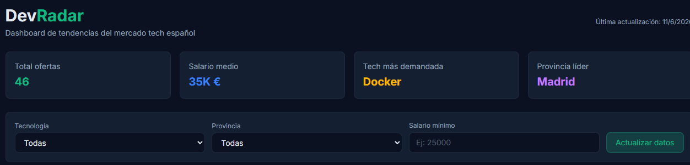
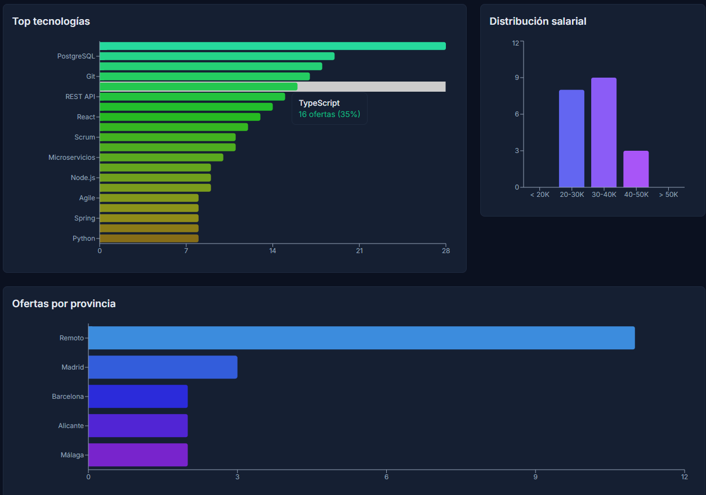
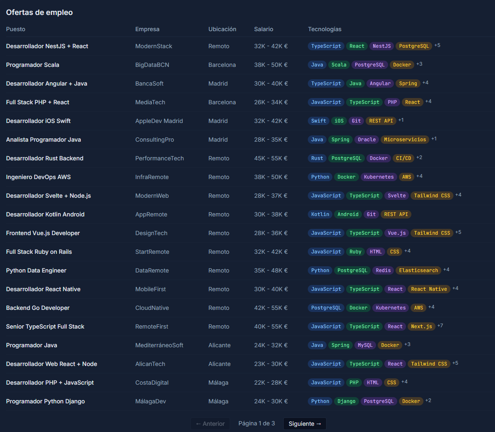

# DevRadar — Dashboard de tendencias tech

Dashboard interactivo que analiza el mercado laboral tech en España, mostrando las tecnologías más demandadas, distribución salarial y ofertas por provincia.





## Funcionalidades

- **Ranking de tecnologías** — Top 20 tecnologías más demandadas con gráfico de barras
- **Distribución salarial** — Visualización por rangos (20-30K, 30-40K, etc.)
- **Ofertas por provincia** — Madrid, Barcelona, Valencia, Remoto...
- **Tabla de ofertas** — Con paginación, empresa, salario y tags de tecnologías
- **Filtros reactivos** — Por tecnología, provincia y salario mínimo
- **Scraper preparado** — Arquitectura lista para scraping real con Cheerio
- **Datos seed** — 46 ofertas realistas para demo funcional

## Stack tecnológico

| Capa       | Tecnología                          |
|------------|-------------------------------------|
| Backend    | Node.js, Express, TypeScript        |
| Scraper    | Cheerio (preparado)                 |
| Base datos | SQLite (better-sqlite3)             |
| Frontend   | React 18, TypeScript                |
| Gráficas   | Recharts                            |
| Estilos    | Tailwind CSS                        |
| Build      | Vite, tsx                           |

## Cómo empezar

### Requisitos previos

- Node.js 18+
- npm

### Instalación

```bash
git clone https://github.com/TUUSER/devradar.git
cd devradar

# Instalar dependencias del servidor
npm install

# Instalar dependencias del cliente
cd client && npm install && cd ..

# Poblar base de datos con datos de ejemplo
npm run seed
```

### Desarrollo

```bash
npm run dev
```

- Servidor en `http://localhost:3002`
- Cliente en `http://localhost:5174` (API proxeada)

## Arquitectura

```
devradar/
├── server/
│   ├── index.ts              # Servidor Express + rutas API
│   ├── db/
│   │   ├── schema.sql        # Tablas: jobs, technologies, job_technologies, scrape_logs
│   │   └── database.ts       # Init SQLite + seed de 55+ tecnologías
│   ├── scraper/
│   │   ├── sources/infojobs.ts  # Scraper InfoJobs (preparado)
│   │   ├── parser.ts         # Normalización de ofertas
│   │   ├── techDetector.ts   # Detección de 55+ tecnologías con variantes
│   │   └── scheduler.ts      # Orquestador de scraping
│   ├── routes/
│   │   ├── dashboard.ts      # GET /api/dashboard (stats generales)
│   │   ├── technologies.ts   # GET /api/technologies (ranking)
│   │   ├── jobs.ts           # GET /api/jobs (paginado + filtros)
│   │   └── scraper.ts        # POST /api/scrape (trigger manual)
│   └── utils/
│       └── normalizer.ts     # Normalización: provincias, salarios, empresas
├── client/
│   └── src/
│       ├── hooks/useDashboardData.ts  # Fetch + filtros reactivos
│       ├── components/        # StatsOverview, TechRanking, SalaryDistribution,
│       │                      # LocationChart, FilterBar, JobsTable
│       └── pages/Dashboard.tsx
├── seed-data.ts               # 46 ofertas ficticias realistas
├── tsconfig.json              # TypeScript strict
└── package.json
```

## Pipeline de datos

1. **Recolección** — El scraper consulta fuentes (InfoJobs, etc.) y parsea HTML con Cheerio
2. **Normalización** — Limpieza de HTML, normalización de provincias y salarios
3. **Detección de tecnologías** — Diccionario de 55+ tecnologías con variantes (React.js→React, etc.)
4. **Almacenamiento** — SQLite con relaciones jobs ↔ technologies
5. **Visualización** — API REST + dashboard React con gráficas Recharts

## Licencia

MIT
